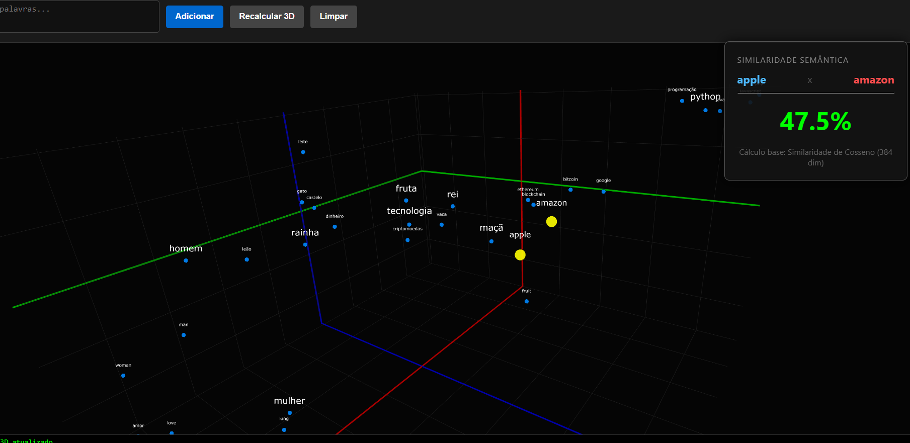
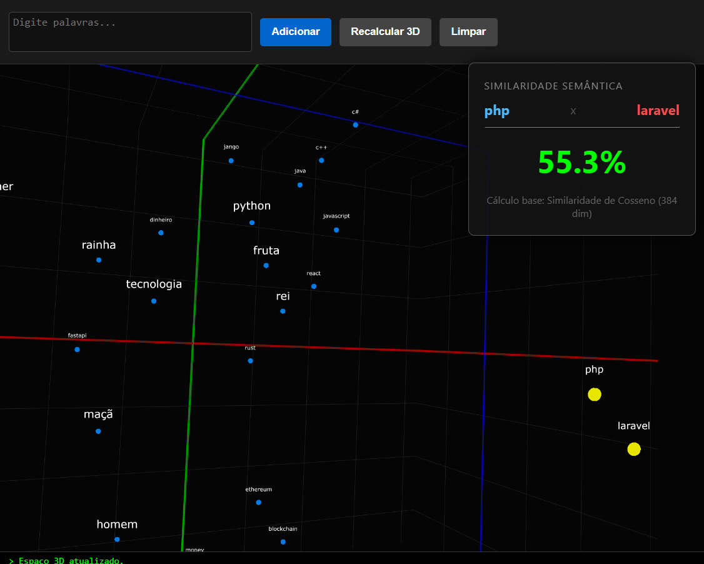

# RAG Embedding Explorer (3D Visualization)

Este projeto é uma ferramenta experimental para geração, armazenamento e visualização de **Embeddings Semânticos** em um espaço tridimensional. 

O sistema utiliza uma arquitetura de **Edge AI**, onde a inferência do modelo de linguagem ocorre diretamente no navegador do cliente (via WebAssembly/ONNX), reduzindo a latência e custos de servidor, enquanto o PHP atua como orquestrador de persistência.


> *Visualização da distribuição semântica de palavras após redução de dimensionalidade (t-SNE).*


> *Visualização da distribuição semântica de palavras após redução de dimensionalidade (t-SNE).*

---

## Objetivo

Desenvolvido no contexto da disciplina de **IA Generativa do PPGI Uninove** (Mestrado/Doutorado em Informática e Gestão do Conhecimento), este projeto visa:
1.  Desmistificar o funcionamento de **Vetores Densos** (Embeddings).
2.  Visualizar matematicamente a proximidade semântica entre termos.
3.  Aplicar algoritmos de redução de dimensionalidade (**t-SNE**) para projetar vetores de 384+ dimensões em um espaço 3D navegável.

## Stack Tecnológico

* **Core AI:** [Transformers.js](https://huggingface.co/docs/transformers.js) (Execução de modelos ONNX no browser).
* **Visualização:** [Plotly.js](https://plotly.com/javascript/) (Gráficos 3D interativos).
* **Algoritmos:** t-SNE (t-Distributed Stochastic Neighbor Embedding) e Similaridade de Cosseno.
* **Armazenamento:** localstorage.
* **Frontend:** JavaScript (ES6 Modules).

## Arquitetura

1.  **Ingestão:** O usuário digita um termo.
2.  **Tokenização & Embedding:** O navegador baixa/carrega o modelo `paraphrase-multilingual-MiniLM-L12-v2` e converte o texto em um vetor de 384 dimensões (float32).
3.  **Armazenamento:** O vetor é enviado para armazenamento local (simulado em memória ou persistido via PHP).
4.  **Redução:** Um algoritmo t-SNE roda em *background* para calcular as coordenadas (x, y, z) baseadas na proximidade dos vetores originais.
5.  **Renderização:** O Plotly plota os pontos, permitindo zoom, rotação e inspeção de similaridade.

## Instalação e Uso

### Pré-requisitos
* Servidor Web Local (Apache/Nginx ou PHP Built-in Server).
* Navegador moderno com suporte a WebAssembly.

### Passo a Passo

1.  **Clone o repositório:**
    ```bash
    git clone https://github.com/faustinopsy/embeddings_space.git
    cd embeddings_space
    ```

2.  **Estrutura de Modelos (Para execução Offline/Local):**
    Para evitar dependência externa a cada reload, baixe os arquivos do modelo no Hugging Face e organize assim:
    ```text
    /models
      └── Xenova
          └── paraphrase-multilingual-MiniLM-L12-v2
              ├── config.json
              ├── tokenizer.json
              ├── tokenizer_config.json
              ├── special_tokens_map.json
              └── onnx
                  └── model_quantized.onnx
    ```

3.  **Execute o Servidor:**
    Se tiver o PHP instalado:
    ```bash
    php -S localhost:8000
    ```

4.  **Acesse:**
    Abra `http://localhost:8000` no seu navegador.

##  Modelos Suportados

O código está otimizado para modelos multilíngues para garantir a correta aproximação semântica em Português:
* Recomendado: `Xenova/paraphrase-multilingual-MiniLM-L12-v2`
* Alternativa leve: `Xenova/all-MiniLM-L6-v2` (Melhor para Inglês)

##  Funcionalidades

* [x] Geração de Embeddings Client-Side.
* [x] Visualização 3D interativa.
* [x] Cálculo de **Similaridade de Cosseno** real (baseado no vetor denso, não na projeção 3D).
* [x] Comparação visual de termos (Highlight e Distância).

## Licença

Este projeto está sob a licença MIT. Sinta-se livre para estudar e modificar.

---
*Desenvolvido por faustinopsy*